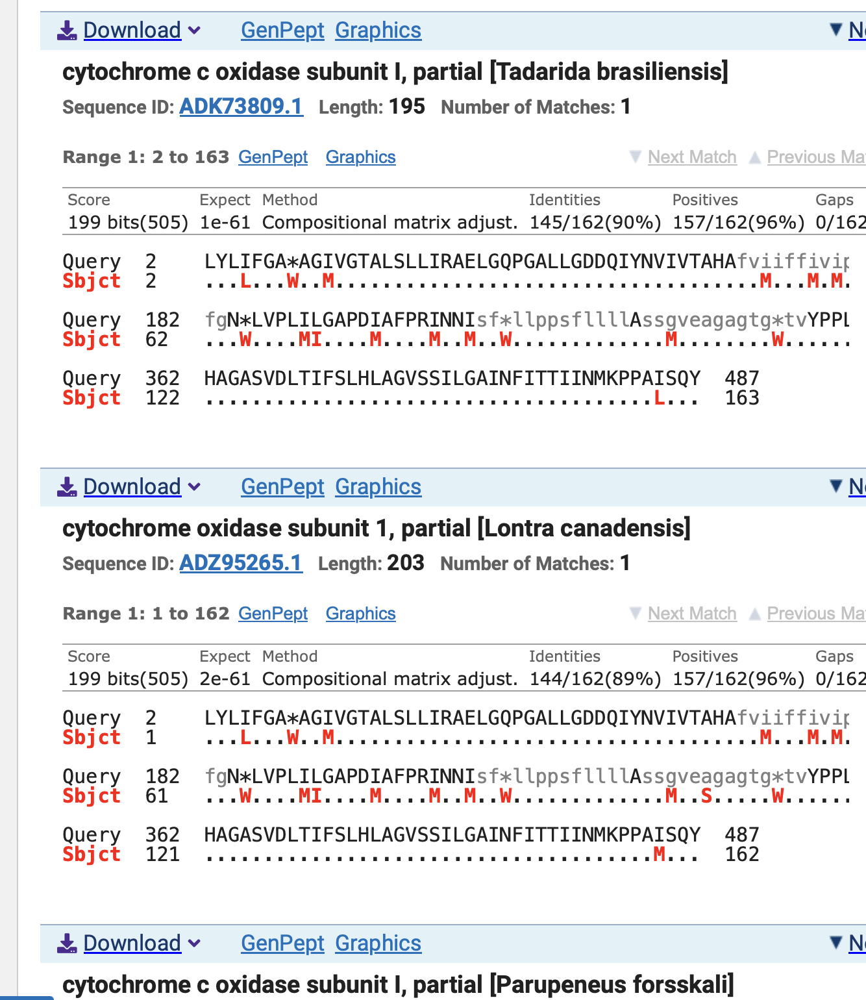
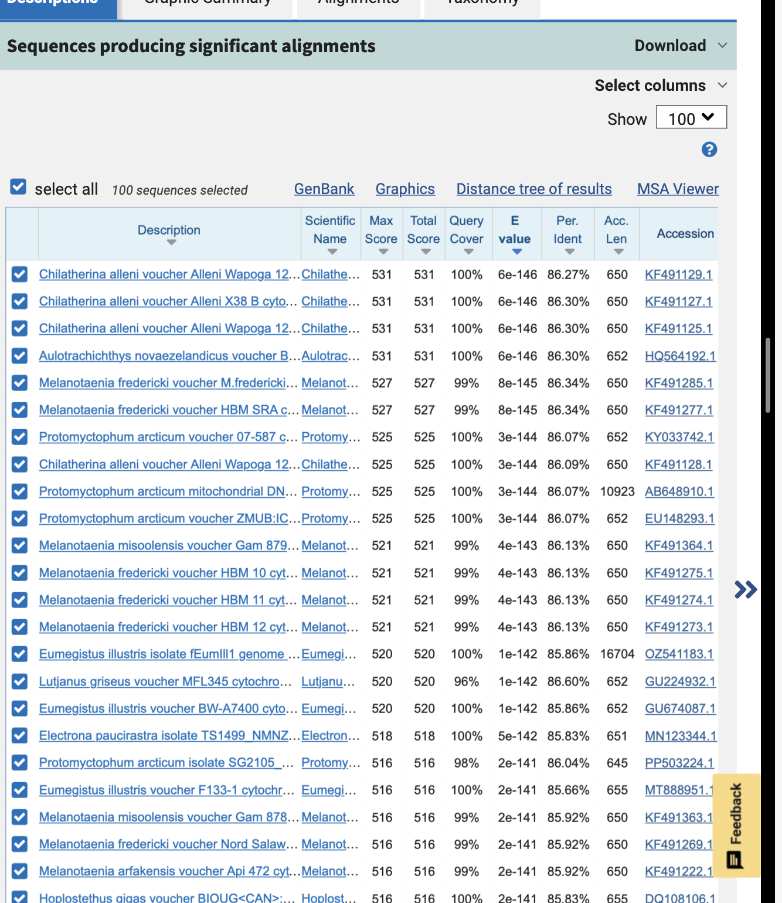

```{=html}
<!--
Before you push, check:
  [ ] this .qmd AND its rendered .html are both committed
  [ ] rendered from a clean session (Session > Restart R, then Render)
  [ ] paths are relative, not absolute: from notebooks/, use ../ (e.g. ../output/weekNN/)
  [ ] tables and figures are saved under output/weekNN/, not only printed here
  [ ] nothing under data/raw/ is committed
  [ ] software, platform, and container/environment are named
  [ ] the commit link is posted as a comment on your Project Proposal issue
Rubric: https://sr320.github.io/course-fish546-2026/how-we-work.html#weekly-entry-rubric
-->


## 1. This week's analysis

<!-- The week's exercise or your project step: commands, code, outputs, and what they mean.
     Link the files in output/weekNN/. Name the platform (laptop / Raven / Klone) and software versions. -->

## 2. Reflection questions

<!-- The 2–3 questions from this week's lecture page, answered with reasoning. -->

1. 
2. 
3. 
=======
```

## 1. This week's analysis

```{=html}
<!-- The week's exercise or your project step: commands, code, outputs, and what they mean.
     Link the files in output/weekNN/. Name the platform (laptop / Raven / Klone) and software versions. -->
```

Blastx \
probably not great will do blastn\
\
Hard to make call which Genus?



Download GenPeptGraphics NextPreviousDescriptions cytochrome c oxidase
subunit I, partial \[Tadarida brasiliensis\] Sequence ID:
ADK73809.1Length: 195Number of Matches: 1 Related Information AlphaFold
Structure-3D structure displays Range 1: 2 to 163GenPeptGraphicsNext
MatchPrevious Match Alignment statistics for match #1 Score Expect
Method Identities Positives Gaps Frame 199 bits(505) 1e-61 Compositional
matrix adjust. 145/162(90%) 157/162(96%) 0/162(0%) +2 Query 2
LYLIFGA\*AGIVGTALSLLIRAELGQPGALLGDDQIYNVIVTAHAfviiffivipiiigg 181
LYL+FGA AG+VGTALSLLIRAELGQPGALLGDDQIYNVIVTAHAFV+IFF+V+PI+IGG Sbjct 2
LYLLFGAWAGMVGTALSLLIRAELGQPGALLGDDQIYNVIVTAHAFVMIFFMVMPIMIGG 61

Query 182 fgN*LVPLILGAPDIAFPRINNIsf*llppsfllllAssgveagagtg\*tvYPPLAGNLA
361 FGN LVPL++GAPD+AFPR+NN+SF LLPPSFLLLLASS VEAGAGTG TVYPPLAGNLA Sbjct
62 FGNWLVPLMIGAPDMAFPRMNNMSFWLLPPSFLLLLASSMVEAGAGTGWTVYPPLAGNLA 121

Query 362 HAGASVDLTIFSLHLAGVSSILGAINFITTIINMKPPAISQY 487
HAGASVDLTIFSLHLAGVSSILGAINFITTIINMKPPA+SQY Sbjct 122
HAGASVDLTIFSLHLAGVSSILGAINFITTIINMKPPALSQY 163

blastn\
\


still tough choice   2. Reflection questions

<!-- The 2–3 questions from this week's lecture page, answered with reasoning. -->

1.  sequences - closesness, how much overlap there is and (evalue) the
    probabilty that this match could happen by chance
2.  could be very short exact match found in lots of taxa
3.  Nice picture (pie chart show different taxa on yellow island)

## 3. Project progress

<!-- What moved this week, with links to commits, files, or figures. -->


=======
NOt much yet -- but will sooon!

## 4. Where I'm stuck

<!-- Specific problems, what you tried, and any linked Help Request. Or "none". -->

## 5. Next week

<!-- One to three concrete, one-week-sized goals. -->

- 
